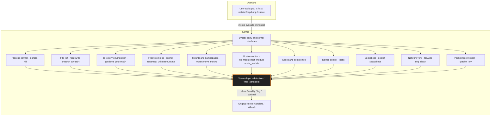

## Hooked Syscalls

* **`pread64` / `pwrite64` (vector I/O variants)**

  * What to look for: partial/offset reads or writes that don’t match expected userland behavior (file contents differing when read normally vs. by offset), or unusual repeated pread/pwrite calls against kernel/state files.
  * Quick triage: compare full-file dumps vs. offset reads; log FD activity and correlate with process ancestry.

* **`move_mount`**

  * What to look for: mounts that appear to move or vanish between namespaces, mount points that are present for some processes but not others, or transient mount events.
  * Quick triage: snapshot `/proc/self/mountinfo` from multiple processes, and compare to `findmnt` and `mount` outputs collected at the same time.

* **`setsockopt`**

  * What to look for: unusual socket option changes (TTL, SO_BINDTODEVICE, IP_TRANSPARENT, TCP_FASTOPEN) by non-networking binaries, or sockets with unexpected options that affect visibility.
  * Quick triage: log setsockopt calls with process creds; flag sockets created by uncommon parents or non-network daemons.

* **`socket`**

  * What to look for: sockets created by odd processes, sockets that never show in `/proc/net/*` but are visible in packet captures, or raw socket creation by non-privileged processes.
  * Quick triage: correlate `socket()` creation logs with packet captures and process trees.

* **`tpacket_rcv`**

  * What to look for: missing packets in userland captures (tcpdump) that do appear on a network tap; inconsistent timestamps or packet counts across capture points.
  * Quick triage: capture at host and at network tap/gateway simultaneously and diff the captures.

* **`tcp*/udp* _seq_show` (proc rendering hooks)**

  * What to look for: sockets visible in packet captures but not in `/proc/net/*`, or `/proc/net/*` outputs that differ between tools.
  * Quick triage: compare `ss -tanp` / `netstat` / `/proc/net` output against offline packet captures.

* **`openat` / `renameat` / `unlinkat` / `truncate`**

  * What to look for: unexpected file removals, renames of logs, truncation of files (zeroed logs), or `openat` on sensitive paths by odd processes.
  * Quick triage: enable auditd rules for sensitive paths and watch for unusual UIDs or process ancestry.

* **`mount`**

  * What to look for: anonymous or private bind mounts appearing, mounts from unusual paths, or mounts created without corresponding userland activity.
  * Quick triage: periodic mountinfo snapshots and monitoring for transient mounts.

* **`init_module` / `finit_module` / `delete_module`**

  * What to look for: failed module loads from legit admins, modules that can’t be removed, or module load attempts from unexpected paths.
  * Quick triage: require signed modules (secure boot), and alert on module load failures and unexpected dmesg denials.

* **`kexec_load`**

  * What to look for: unexpected kernel image reads, kexec syscalls, or reboots initiated without admin intent.
  * Quick triage: log kernel image reads and alert on kexec syscalls from non-admin contexts.

* **`kill`**

  * What to look for: frequent signals to privileged processes, `EPERM` or unexpected denial errors when admins try to send signals, or signal storms targeting certain PIDs.
  * Quick triage: log `kill()` syscall attempts and correlate caller UID/PID.

* **`ioctl`**

  * What to look for: blocked or failing ioctls on tracing or forensic devices (`/dev/*tracing*`, `/dev/mem`), or odd ioctl sequences from unknown binaries.
  * Quick triage: monitor ioctl failures from trusted tools and inspect additional kernel logs around those timestamps.

---

